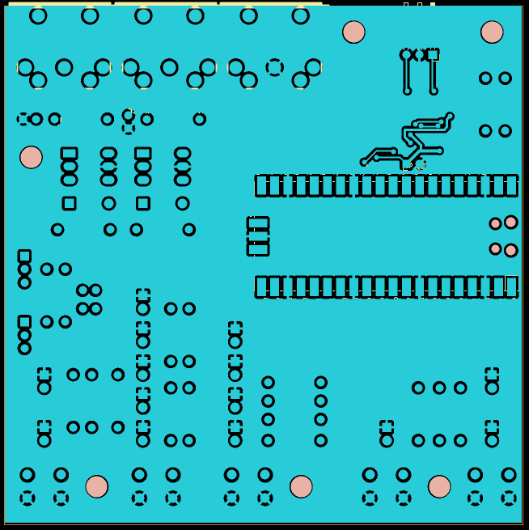
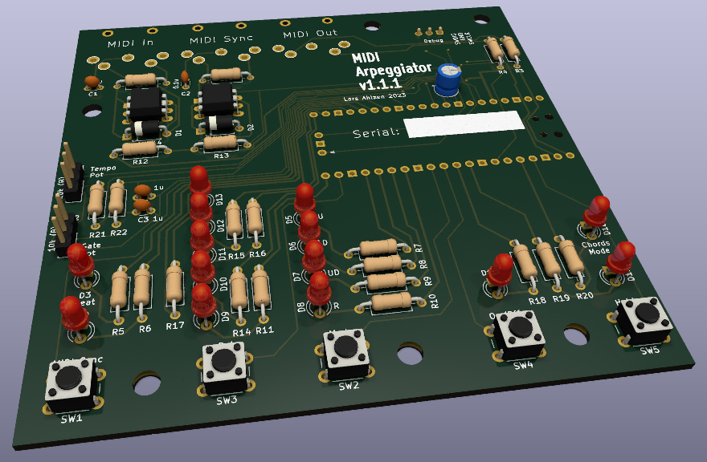

# MIDI-arpeggiator-1.1-electronics
Schematics and PCB design for MIDI Arpeggiator v1.1

For KiCad 7

RP2040 Firmware at:
https://github.com/Ahlzen/MIDI-arpeggiator-1.1-firmware

Raspberry Pi Pico symbols, footprints and 3D models from:
https://github.com/ncarandini/KiCad-RP-Pico
(CC-BY-SA 4.0)

Female DIN (MIDI) connector symbol and footprint from:
https://github.com/nebs/eurocad

## Images and Resources

[PDF Schematic](Images/ArpeggiatorV1.1.pdf)

## TODO

* Pull in KiCAD-RP-Pico and Eurocad libraries as submodules.
* Ensure all components values on schematic + PCB silkscreen
* Include proper BOM and build notes
* Add photos of assembled PCB
